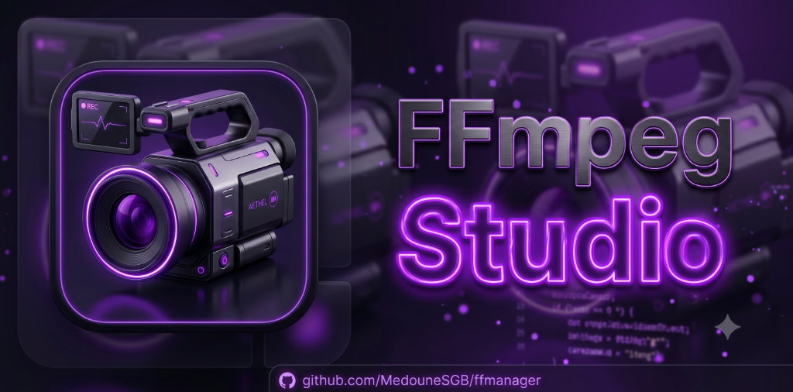
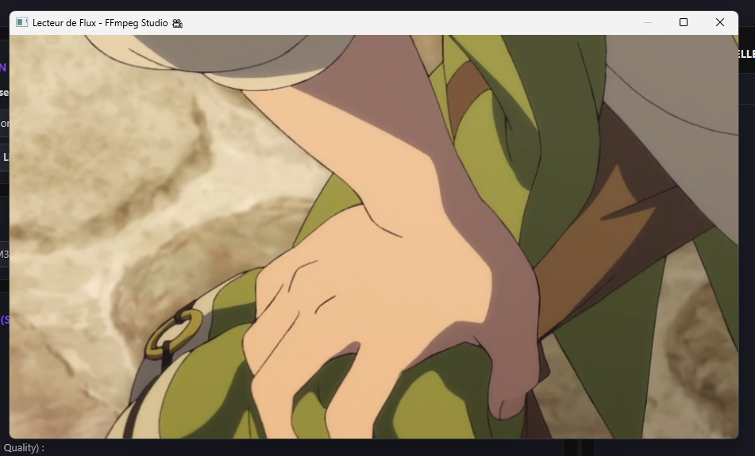
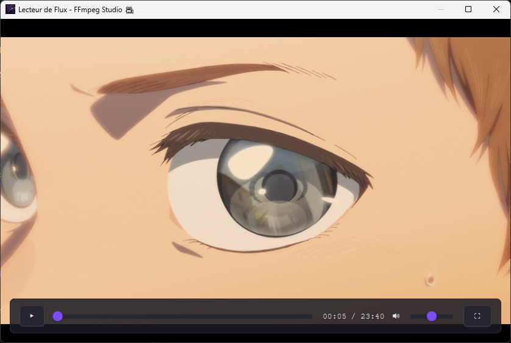
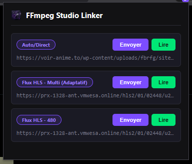

# FFmpeg Studio 🎥

<p align="center">
  
</p>

<p align="center">
  <b>Le studio tout-en-un pour FFmpeg : convertir, compresser, télécharger et lire vos vidéos — file d'attente, lecteur VLC intégré, capture de flux web et extension Chrome, dans une interface moderne.</b>
</p>

<p align="center">
  
  
  
  
  <a href="https://github.com/sponsors/MedouneSGB"></a>
</p>

---
<p align="center">
  <a href="https://github.com/MedouneSGB/ffmanager/releases/download/v0.2.38/FFmpegStudio-Portable-Windows.zip">
    
  </a>
</p>

---

## 🌟 Présentation

**FFmpeg Studio** est une interface graphique (GUI) moderne, fluide et performante développée en JavaFX. Conçue pour simplifier la manipulation des commandes FFmpeg complexes, elle intègre un gestionnaire de tâches séquentiel, un lecteur vidéo de streaming haut de gamme, et un module d'extraction automatique de flux réseau (MVP MediaHunter).

Que vous souhaitiez convertir des fichiers locaux, extraire des pistes audio, télécharger des flux HLS à la volée ou prévisualiser des flux distants en direct, FFmpeg Studio regroupe tous ces outils dans un environnement sombre esthétique, cohérent et ergonomique.

---

## 💜 Soutenir le projet

FFmpeg Studio est un logiciel **gratuit et open-source**, développé sur mon temps libre. Si l'outil vous est utile, vous pouvez soutenir son développement et m'aider à continuer à l'améliorer :

<p align="center">
  <a href="https://github.com/sponsors/MedouneSGB">
    
  </a>
</p>

👉 **[github.com/sponsors/MedouneSGB](https://github.com/sponsors/MedouneSGB)** — à partir de **5 $/mois** ou via un **don ponctuel**.

Chaque contribution finance le temps de développement, les corrections de bugs et les nouvelles fonctionnalités. Un grand merci à toutes celles et ceux qui soutiennent le projet ! 🙏

Vous pouvez aussi soutenir gratuitement en mettant une ⭐ au dépôt et en partageant l'outil.

---

## 📸 Aperçu de l'Application

### Tableau de bord principal (File d'attente & Surcharges)


### Lecteur vidéo flottant (Contrôles auto-hide & Plein écran)


### Extension Chrome (FFmpeg Studio Linker)


---

## 🚀 Fonctionnalités Clés

### 🎨 1. Interface Premium & Thème Sombre Harmonieux
*   Une refonte complète des styles par défaut de JavaFX (Modena) avec une charte graphique sombre haut de gamme.
*   Panneaux sous forme de cartes d'action, curseurs de sélection et badges de statut colorés progressifs (`EN ATTENTE`, `EN COURS`, `TERMINÉ`, `ÉCHEC`, `ANNULÉ`).
*   Intégration d'une icône applicative 3D personnalisée dans la barre des tâches et dans l'en-tête de l'application.

### 🔍 2. Module d'Extraction Asynchrone (MediaHunter MVP)
*   **Analyse automatique** : Saisissez l'URL d'une page Web contenant une vidéo (ex: plateforme de streaming, anime) et cliquez sur `🔍 Détecter`.
*   Le moteur de recherche (`StreamDetector`) va automatiquement scanner la page et ses `<iframe>` enfants en arrière-plan à l'aide de requêtes HTTP isolées (avec referers adéquats pour éviter le blocage).
*   **Détection des qualités HLS** : Si le flux extrait est un master HLS (`.m3u8`), le service télécharge temporairement le fichier, analyse les balises `#EXT-X-STREAM-INF` et présente à l'utilisateur les résolutions disponibles (ex : `360p`, `720p`, `1080p`).
*   **Choix dynamique** : Boîte de dialogue épurée permettant de charger la qualité de votre choix directement dans le champ URL de l'application, en affichant la qualité et le nom de domaine source pour optimiser l'espace.

### 🎥 3. Lecteur de Streaming Avancé
*   **Commandes auto-hide fluides** : Pendant la lecture de votre vidéo locale ou distante, la barre de commandes flottante au bas de l'écran ainsi que le curseur de la souris s'estompent et disparaissent automatiquement après **2,5 secondes d'inactivité** pour un confort de visionnage total. Un simple mouvement de souris ou de glissement les fait réapparaître instantanément.
*   **Stabilité de mise en page** : Utilisation d'un calque `StackPane` qui évite tout scintillement ou redimensionnement saccadé de la vidéo lors du masquage des contrôles.
*   **Raccourcis clavier & Plein écran** :
    *   `Espace` : Play / Pause
    *   `M` : Activer / Désactiver le son (Muet)
    *   `F` ou double-clic sur la vidéo : Basculer en mode Plein écran
    *   Clic direct sur la barre de recherche temporelle (Seek) pour naviguer instantanément dans la vidéo.

### ⚙️ 4. File de Traitement Séquentielle & Robustesse
*   **Probing automatique** : Utilisation de `ffprobe` en arrière-plan pour estimer la durée exacte des vidéos et des flux réseau afin d'afficher un pourcentage de progression en temps réel (`0%` à `100%`).
*   **Nettoyage automatique** : En cas d'échec ou d'annulation d'un téléchargement/conversion en cours, FFmpeg Studio supprime automatiquement les fichiers temporaires corrompus ou partiels pour ne pas encombrer votre disque dur.
*   **Détection d'environnement** : Recherche automatique des exécutables `ffmpeg` et `ffprobe` sur votre système (avec possibilité de configurer des chemins absolus personnalisés).

---

## 🛠️ Configuration & Installation

### Prérequis
*   **Java Development Kit (JDK) 21** ou supérieur.
*   **Maven** pour la gestion des dépendances et de la compilation.
*   **FFmpeg** et **ffprobe** : **inutiles avec les versions packagées** (portable ZIP / installeur EXE / DMG), qui embarquent directement les binaires — l'application fonctionne dès le premier lancement, sans installation ni configuration du `PATH`.
    *   *Uniquement pour le lancement en mode développement* (`mvn javafx:run`), FFmpeg doit être installé et accessible via le `PATH` (ou configuré manuellement via l'interface).
    *   *Installation sous Windows* : `winget install ffmpeg`
    *   *Liens utiles* : [Dépôt GitHub FFmpeg](https://github.com/FFmpeg/FFmpeg) | [Site officiel FFmpeg](https://ffmpeg.org/)

### Compilation
Pour compiler et packager l'application sous forme de JAR "fat-shaded" autonome contenant toutes les dépendances (y compris JavaFX et Jsoup) :
```bash
mvn clean package
```
Le fichier JAR généré se trouvera dans le dossier `target/` sous le nom `ffmpeg-studio-0.2.10.jar`.

### Lancement
Pour lancer l'application en mode développement via Maven :
```bash
mvn javafx:run
```
Pour exécuter directement le JAR packagé :
```bash
java -jar target/ffmpeg-studio-0.2.10.jar
```

---

## 📖 Profils de Conversion Disponibles
FFmpeg Studio propose plusieurs profils préconfigurés adaptés à vos besoins :
*   **Standard (MP4 - H.264/AAC)** : Conversion universelle hautement compatible.
*   **Qualité Archive (H.265/HEVC - AAC)** : Compression maximale avec préservation de la qualité visuelle.
*   **Extraire l'audio (MP3)** : Extraction rapide de la bande sonore uniquement.
*   **Remux sans réencodage (MP4 - Copy)** : Changement de conteneur ultra-rapide sans perte de qualité.
*   **Télécharger un flux réseau (Stream Copy)** : Extraction et assemblage direct de flux HLS distants au format MP4.
